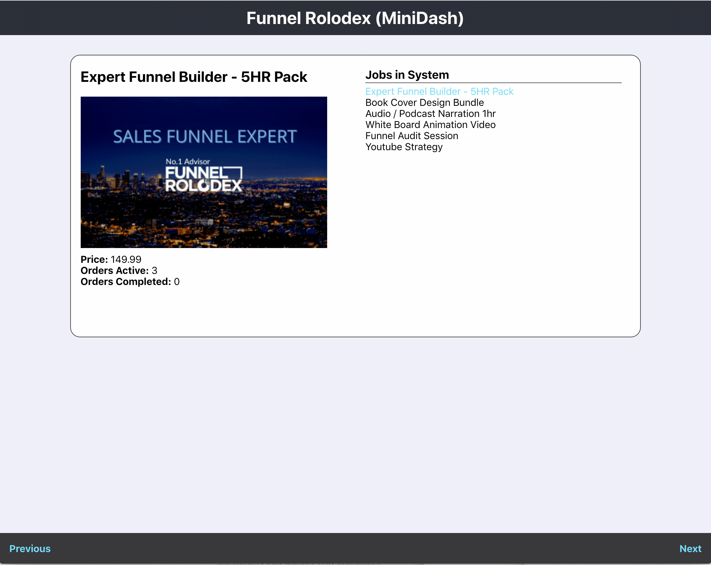

# Funnel Rolodex Candidate Solution

Welcome to the Funnel-Rolodex Candidate Solution project.  We have detailed instructions for how to get started and what a successful solution will entail.  Please read and follow these instructions so that it is clear the expectations.

## What it is we are building?

At Funnel Rolodex, our core business is as a marketplace that Sellers can post __JOBS__ and Buyers can purchase __ORDERS__ of those jobs.  Our challenge is to build a mini-dashboard that can displays a given set of jobs and their corresponding orders.



## What we provide?

### The Code Layout

Inside of this repository there are two directories:

```shell
.
├── front-end
└── local-api
```

The `front-end` folder is a __Create-React-App__ that we provide a skeleton set of CSS and React components to get started.  Your solution should implement a version of the UI pictured above, feel free to improve the design and add any improvements.  Your solution should communicate to the `local-api`, the default port is `3050`.  :warning: Do not use the __Remote-API__ as your data source.

The `local-api` folder contains a version of an Express-App API.  Inside of it we are expecting two endpoints to be implemented `/list` and `/jobs/:jobId` that act as a proxy to the __Remote-API-Source__.  There are integrations tests written in [Mocha](https://mochajs.org/) that we expect to pass.  You should not have to modify the tests.

### Remote-API Source

As mentioned we provide an external API that we expect you to build the local-api around as a proxy.  The following endpoints exist:

- [External-API: List Jobs](https://takehome-remote-source-api.herokuapp.com/list)
- [External-API: Job/:jobId ](https://takehome-remote-source-api.herokuapp.com/job/3)
- [External-API: Orders/:jobId ](https://takehome-remote-source-api.herokuapp.com/orders/3)

## Submitting a Successful Solution

### 1. Setting Up Your Solution

Your solution should be built in your own private repository, please do not fork our repository.  Use `git clone`.  Push up your local code into the repository as `master` or `main`.

### 2. Create a Branch & PR

A successful solution will show us how you work and progress through a problem.  Create your solution as a branch and push commits up as your work. The sooner you open up your work as a PR the better as our github-actions will validate the test runner.  

### 3. Finalize & Submit

Once you are satisfied with your solution and the tests are passing.  Adding `mgan59` and `seointern` to the repository.

### 4. Review Process

Once the reviewers are added to the repository, we will conduct a quick PR review and setup a time to go over the code together.